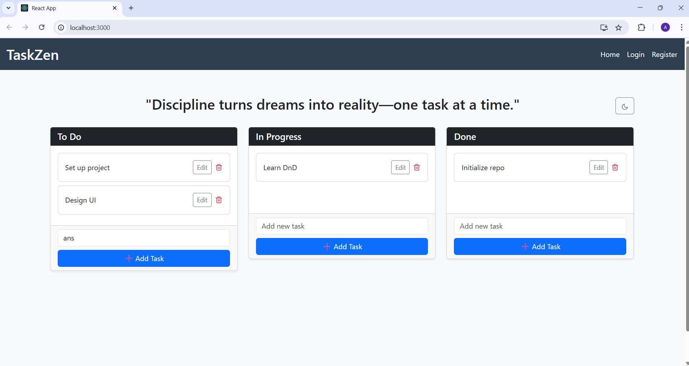

# TaskZen 🧠✅

> "Discipline turns dreams into reality—one task at a time."

**TaskZen** is a sleek and intuitive task management application built with React. It helps users organize their workflow visually using a **drag-and-drop interface**, with tasks sorted into three categories: **To Do**, **In Progress**, and **Done**.

---

## 🚀 Features

- 📝 **Add, Edit, and Delete Tasks**  
- 📦 **Drag and Drop** tasks between columns (To Do ↔ In Progress ↔ Done)
- 🌗 **Theme Toggle** – Light/Dark mode switch
- 🔒 **Authentication Pages** (Login, Register)
- 🧠 **Motivational Quote** header to boost productivity
- 🎨 Clean, responsive UI built with **Bootstrap**

---

## 📸 Screenshot

  


---

## 🛠️ Tech Stack

- **Frontend:** React, JavaScript, Bootstrap, CSS
- **State Management:** useState, useEffect, custom hooks
- **Drag-and-Drop:** `react-beautiful-dnd`
- **Routing:** `react-router-dom`
- *(Optional for full-stack version: Express, MongoDB, Node.js)*

---

## 📁 Folder Structure (Simplified)
TaskZen/
│
├── public/
├── src/
│ ├── components/
│ ├── pages/
│ ├── App.jsx
│ ├── index.js
├── .gitignore
├── package.json
└── README.md

## 🧑‍💻 Getting Started

### 1. Clone the Repository

```bash
git clone https://github.com/ANSHIKA-YDV/TaskZen.git
cd TaskZen/client

